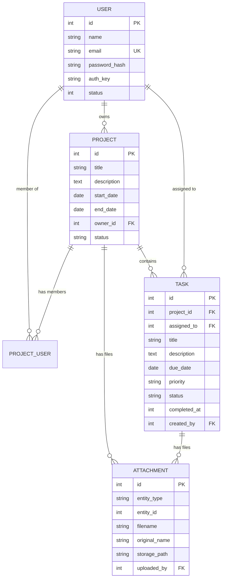

# Dever.io

**Sistema de Gerenciamento de Tarefas para Desenvolvedores**

Este sistema foi desenvolvido por Thomaz Juliann Boncompagni, para o teste técnico da vaga de Desenvolvedor Fullstack PHP Pleno da Empresa Leme Forense. É um Sistema completo para gerenciar projetos e tarefas com colaboração em equipe, upload de arquivos e dashboard em tempo real.

O projeto foi inicializado utilizando o Yii2 via Composer sendo injetado como dependência, com um bootstrap customizado ao invés de usar diretamente os templates basic ou advanced. O projeto é conteinerizado e possui isolamento e controle individual das ferramentas utilizadas.

Para a maior clareza e organização do código, a maioria dos comentários feitos, foi escrita utilizando a convenção DocBlock muito conhecida no PHP. 

Partes do código Front-End, das Seeds e do Makefile foram escritas com auxílio do Claude Opus 4.6 (devidamente revisadas e comentadas) para manter o padrão visual dos formulários, estilizações de botões, coerencia visual, legibilidade de comandos make e melhor organização. 

Preferi isolar os Testes em uma pasta fora do projeto do Yii2, para permitir clareza e que testes fora do escopo do Yii2 possam ser implementados caso necessário. Alguns dos testes ainda utilizam rotinas do Yii através do autoload do Composer. No TestCase, faço o bootstrap da aplicação para garantir que o ambiente seja consistente. Isso traz um leve acoplamento, mas simplifica a escrita e manutenção dos testes dentro do escopo do projeto.

---

## Stack Tecnológica

| Camada      | Tecnologia                   |
|-------------|------------------------------|
| Backend     | PHP 8.3 + Yii2 Framework     |
| Frontend    | Tailwind CSS + Lucide Icons  |
| Banco       | MySQL 8.0                    |
| Storage     | MinIO (S3-compatible)        |
| Infra       | Docker + Docker Compose      |
| Testes      | PHPUnit 10                   |

---

## Funcionalidades

- **Autenticação** — Login, registro e sessões seguras com `DbSession`
- **Projetos** — CRUD completo com gerenciamento de membros e anexos
- **Tarefas** — CRUD com prioridades (alta/média/baixa), status, filtros e atribuição
- **Dashboard** — Contadores, tarefas atrasadas, próximas do vencimento e projetos recentes
- **Upload** — Armazenamento de arquivos no MinIO com URLs pré-assinadas
- **Segurança** — CSRF, XSS prevention, validação de MIME e VerbFilter

---

## Instalação

### Pré-requisitos

- Docker e Docker Compose instalados.

### Comandos Disponíveis

A Utilização dos comandos make é opcional (makefile), mas altamente recomendada para melhor gerenciamento dos conteiners e testes do projeto.

```bash
# 🐳 Docker
make up          # Sobe os containers
make down        # Derruba os containers
make build       # Builda os containers
make restart     # Reinicia os containers
make logs        # Mostra logs
make logs-php    # Logs do PHP
make bash        # Entra no container PHP

# 📦 Dependências
make composer    # Instala dependências PHP
make migrate     # Roda migrations
make seed        # Popula banco com dados demo

# ⚡ Setup
make setup       # Setup completo (composer + migrate)
make setup-full  # Setup completo + seed

# 🧪 Testes
make test        # Roda todos os testes
make test-unit   # Apenas testes unitários

# 🧹 Limpeza
make clean       # Limpa containers e volumes
make clean-all   # Limpa tudo

# 📊 Status
make status      # Status dos containers
make ps          # Lista containers
```


### Subir o Ambiente

**Opção 1: Makefile (Recomendado)**

```bash
# Clonar o repositório
git clone https://github.com/thomazjb/dever.io.git
cd dever.io

# Subir os containers
make up

# Aguardar o entrypoint executar:
# - composer install
# - migrations
# - php-fpm start
```

**Opção 2: Docker Compose Direto**

```bash
# Clonar o repositório
git clone https://github.com/thomazjb/dever.io.git
cd dever.io

# Subir os containers
docker compose up -d

# Aguardar o entrypoint executar:
# - composer install
# - migrations
# - php-fpm start
```

A aplicação estará disponível em **http://localhost:8080**

### Configurar dados de demonstração (seed)

**Opção 1: Makefile (Recomendado)**

```bash
make seed
```

**Opção 2: Docker Compose Direto**

```bash
docker compose exec php php /var/www/html/yii seed
```

Isso cria 4 usuários, 3 projetos e 20 tarefas de exemplo.

**Usuários criados no seed:**

| Nome | Email | Senha |
|------|-------|-------|
| Admin Dever.io | `admin@dever.io` | `admin123` |
| João Silva | `joao@dever.io` | `senha123` |
| Maria Santos | `maria@dever.io` | `senha123` |
| Pedro Oliveira | `pedro@dever.io` | `senha123` |

**Login recomendado para teste:**
```
Email: admin@dever.io
Senha: admin123
```

---
## Setup Rápido - Makefile (Recomendado)

Para facilitar o desenvolvimento, incluímos um `Makefile` com comandos comuns:

```bash
# Setup completo com dados de demonstração (recomendado para primeiros usos)
make setup-full

# Ou setup básico
make setup
make migrate
make seed
```

### Exemplo de Primeiro Uso

```bash
git clone https://github.com/thomazjb/dever.io.git
cd dever.io
make setup-full
```

A aplicação estará pronta em **http://localhost:8080** com dados de demonstração!

---
## Estrutura do Projeto

O projeto é organizado em pastas claras para separar infraestrutura, aplicação e testes.
A pasta `docker/` contém a configuração de containeres e serviços. A pasta `src/` concentra a aplicação Yii2 em MVC, com controllers, models, views e componentes de infraestrutura. A pasta `tests/` guarda testes unitários e de integração, com bootstrap e configuração próprios.

```
dever.io/
├── docker/                      # Containers: PHP, Nginx e MySQL
│   ├── mysql/
│   │   └── init.sql             # Inicialização do banco
│   ├── nginx/
│   │   └── default.conf         # Configuração do Nginx
│   └── php/
│       ├── Dockerfile           # PHP 8.3-FPM
│       └── entrypoint.sh        # Setup do container PHP
├── src/                         # Código da aplicação Yii2
│   ├── commands/                # Console commands (SeedController)
│   ├── components/              # Serviços customizados (MinioComponent)
│   ├── config/                  # Configurações web, console, db, params
│   ├── controllers/             # Regras de negócio e rotas
│   ├── migrations/              # Criação de tabelas
│   ├── models/                  # Entidades e formulários
│   ├── views/                   # Templates e layouts
│   │   ├── auth/
│   │   ├── dashboard/
│   │   ├── project/
│   │   └── task/
│   └── web/                     # Entry point e recursos públicos
├── tests/                       # Testes unitários e funcionais
│   ├── functional/              # Testes de fluxo da aplicação
│   ├── unit/                    # Testes de models e controllers
│   ├── bootstrap.php           # Bootstrap de testes
│   ├── config.php               # Configuração de ambiente de teste
│   └── TestCase.php             # Base de testes e helpers
├── docker-compose.yml           # Orquestração do ambiente Docker
├── Makefile                    # Atalhos para setup e deploy
├── phpunit.xml                 # Configuração do PHPUnit
└── README.md                    # Documentação do projeto
```

---

## Testes

Para melhor isolamento dos testes unitários, no armazenamento de informações em memória, foi utilizado SQLite.

### Opção 1: Makefile (Recomendado)

```bash
# Rodar todos os testes
make test

# Apenas unitários
make test-unit
```

### Opção 2: Docker Compose Direto

```bash
# Rodar todos os testes
docker compose exec php vendor/bin/phpunit --configuration /var/www/html/phpunit.xml

# Apenas unitários
docker compose exec php vendor/bin/phpunit --testsuite Unit --configuration /var/www/html/phpunit.xml
```

### Com Relatório de Cobertura

**Makefile:**
```bash
make test -- --coverage-text
```

**Docker Compose Direto:**
```bash
docker compose exec php vendor/bin/phpunit --coverage-text --configuration /var/www/html/phpunit.xml
```

---

## Comandos Úteis
### Makefile (Recomendado)

```bash
# Acessar container PHP
make bash

# Rodar migrations
make migrate

# Popular banco (seed)
make seed

# Limpar banco
docker compose exec php php /var/www/html/yii seed/clear

# Logs da aplicação
make logs
```

### Docker Compose (Alternativo)
```bash
# Acessar container PHP
docker compose exec php bash

# Rodar migrations
docker compose exec php php /var/www/html/yii migrate

# Popular banco (seed)
docker compose exec php php /var/www/html/yii seed

# Limpar banco
docker compose exec php php /var/www/html/yii seed/clear

# Logs da aplicação
docker compose logs -f php
```

---

## Banco de Dados

No descritivo do teste técnico me foram pedidos Diagrama de entidades e relacionamentos (DER) do banco de dados. Para melhor interpretação do diagrama estou utilizando o mermaid dentro deste arquivo MD e que será considerado na visualização pelo GitHub. 



---

## Variáveis de Ambiente

Definidas no `docker-compose.yml`:

| Variável          | Descrição                | Padrão         |
|-------------------|--------------------------|----------------|
| `DB_HOST`         | Host do MySQL            | `mysql`        |
| `DB_NAME`         | Nome do banco            | `dever_io`     |
| `DB_USER`         | Usuário do banco         | `dever`        |
| `DB_PASS`         | Senha do banco           | `dever_secret` |
| `MINIO_ENDPOINT`  | URL do MinIO             | `http://minio:9000` |
| `MINIO_KEY`       | Access key do MinIO      | `minioadmin`   |
| `MINIO_SECRET`    | Secret key do MinIO      | `minioadmin`   |
| `MINIO_BUCKET`    | Bucket para uploads      | `dever-files`  |

---

## Licença
Como se trata de um teste com propósito não comercial, todas as partes do código são licenciadas pela MIT License — veja [LICENSE](LICENSE) para detalhes.
